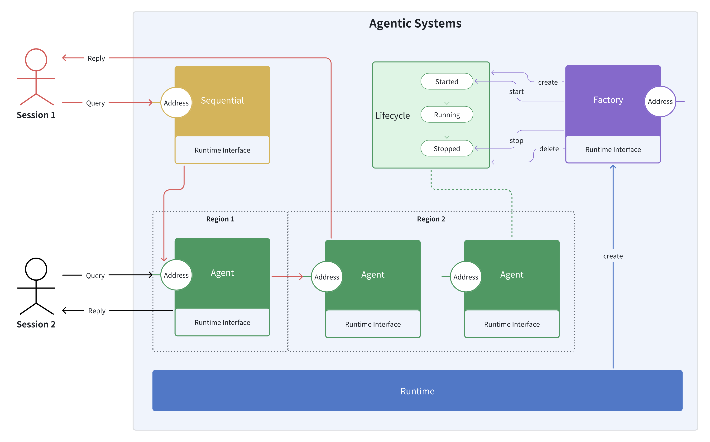
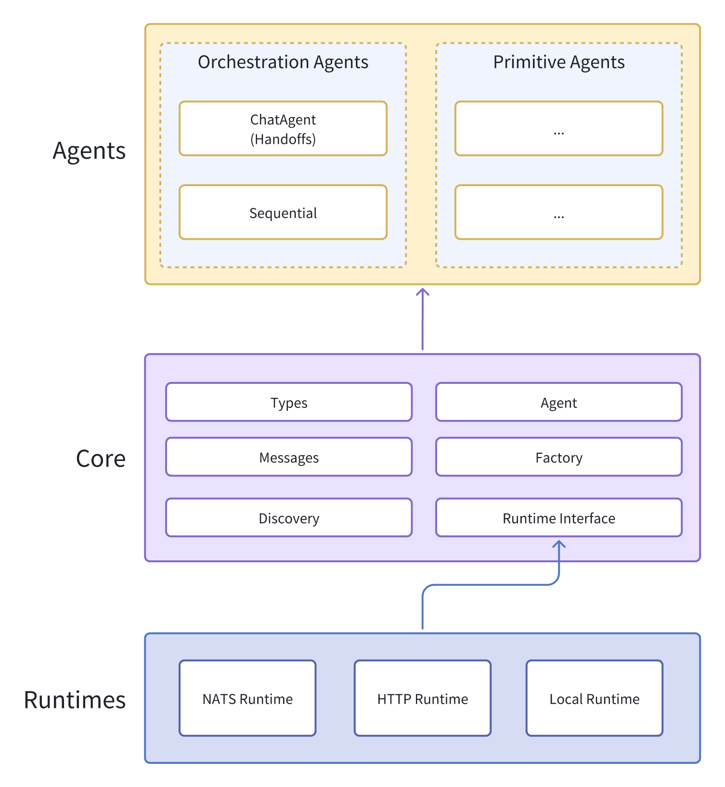
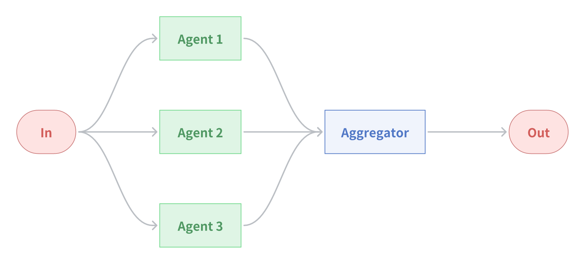
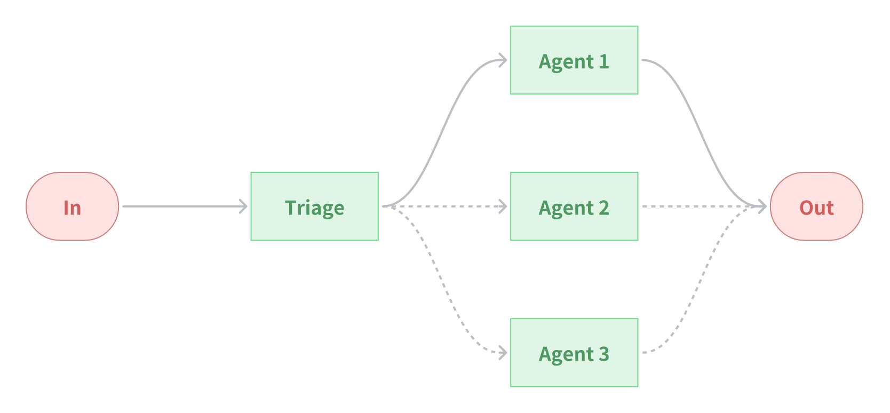

# Coagent
[](https://github.com/OpenCSGs/coagent/actions?query=event%3Apush+branch%3Amain+workflow%3ACI)

An open-source framework for building monolithic or distributed agentic systems, ranging from simple LLM calls to compositional workflows and autonomous agents.


<p align="center">

</p>


## Latest Updates

- 🚀 **2025-01-17**: Added integration with [LiteLLM](https://github.com/BerriAI/litellm).


## Features

- [x] Event-driven
- [x] Monolithic or Distributed
- [x] Single-agent
    - [x] Function-calling
    - [ ] ReAct
- [x] Multi-agent orchestration
    - [x] Agent Discovery
    - [x] Static orchestration
        - [x] Sequential
        - [x] Parallel
    - [x] Dynamic orchestration
        - [x] Dynamic Triage
        - [x] Handoffs (based on async Swarm)
        - [ ] Group Chat
- [x] Runtime
    - [x] Local Runtime (In-process Runtime)
    - [x] HTTP Runtime (HTTP-based Distributed Runtime)
    - [x] NATS Runtime (NATS-based Distributed Runtime)
        - [ ] Using NATS [JetStream][1]
- [x] [CoS](coagent/cos) (Multi-language support)
    - [x] [Python](examples/cos/cos.py)
    - [x] [Node.js](examples/cos/cos.js)
    - [x] [Go](examples/cos/goagent)
    - [ ] Rust


## Three-tier Architecture

<p align="center">

</p>


## Installation

```bash
pip install git+https://github.com/OpenCSGs/coagent.git
```


## Quick Start


### Monolithic

Implement the agent:

```python
# translator.py

import asyncio
import os

from coagent.agents import StreamChatAgent, ChatMessage, ModelClient
from coagent.core import AgentSpec, new, set_stderr_logger
from coagent.runtimes import LocalRuntime

client = ModelClient(
    model=os.getenv("MODEL_NAME"),
    api_base=os.getenv("MODEL_API_BASE"),
    api_version=os.getenv("MODEL_API_VERSION"),
    api_key=os.getenv("MODEL_API_KEY"),
)

translator = AgentSpec(
    "translator",
    new(
        StreamChatAgent,
        system="You are a professional translator that can translate Chinese to English.",
        client=client,
    ),
)


async def main():
    async with LocalRuntime() as runtime:
        await runtime.register(translator)

        result = translator.run_stream(
            ChatMessage(role="user", content="你好，世界").encode()
        )
        async for chunk in result:
            msg = ChatMessage.decode(chunk)
            print(msg.content, end="", flush=True)


if __name__ == "__main__":
    set_stderr_logger()
    asyncio.run(main())
```

Run the agent:

```bash
export MODEL_NAME=<YOUR_MODEL_NAME>
export MODEL_API_BASE=<YOUR_MODEL_API_BASE>
export MODEL_API_VERSION=<YOUR_MODEL_API_VERSION>
export MODEL_API_KEY=<YOUR_MODEL_API_KEY>
python translator.py
```


### Distributed

Start a NATS server ([docs][2]):

```bash
docker run -p 4222:4222 --name nats-server -ti nats:latest
```

Implement the agent:

```python
# translator.py

import asyncio
import os

from coagent.agents import StreamChatAgent, ModelClient
from coagent.core import AgentSpec, idle_loop, new, set_stderr_logger
from coagent.runtimes import NATSRuntime

client = ModelClient(
    model=os.getenv("MODEL_NAME"),
    api_base=os.getenv("MODEL_API_BASE"),
    api_version=os.getenv("MODEL_API_VERSION"),
    api_key=os.getenv("MODEL_API_KEY"),
)

translator = AgentSpec(
    "translator",
    new(
        StreamChatAgent,
        system="You are a professional translator that can translate Chinese to English.",
        client=client,
    ),
)


async def main():
    async with NATSRuntime.from_servers("nats://localhost:4222") as runtime:
        await runtime.register(translator)
        await idle_loop()


if __name__ == "__main__":
    set_stderr_logger()
    asyncio.run(main())
```

Run the agent as a daemon:

```bash
export MODEL_NAME=<YOUR_MODEL_NAME>
export MODEL_API_BASE=<YOUR_MODEL_API_BASE>
export MODEL_API_VERSION=<YOUR_MODEL_API_VERSION>
export MODEL_API_KEY=<YOUR_MODEL_API_KEY>
python translator.py
```

Communicate with the agent:

```bash
coagent translator -H type:ChatMessage --chat -d '{"role": "user", "content": "你好，世界"}'
```


## Patterns

### Workflow: Chaining

**Chaining** decomposes a task into a sequence of steps, where each agent processes the output of the previous one.

<p align="center">

</p>

**When to use this workflow:** This workflow is ideal for situations where the task can be easily and cleanly decomposed into fixed subtasks. The main goal is to trade off latency for higher accuracy, by making each agent an easier task.

**Example** (see [examples/patterns/chaining.py](examples/patterns/chaining.py) for a runnable example):

```python
from coagent.agents import ChatAgent, StreamChatAgent, Sequential, ModelClient
from coagent.core import AgentSpec, new

client = ModelClient(...)

extractor = AgentSpec(
    "extractor",
    new(
        ChatAgent,
        system="""\
Extract only the numerical values and their associated metrics from the text.
Format each as 'value: metric' on a new line.
Example format:
92: customer satisfaction
45%: revenue growth\
""",
        client=client,
    ),
)

converter = AgentSpec(
    "converter",
    new(
        ChatAgent,
        system="""\
Convert all numerical values to percentages where possible.
If not a percentage or points, convert to decimal (e.g., 92 points -> 92%).
Keep one number per line.
Example format:
92%: customer satisfaction
45%: revenue growth\
""",
        client=client,
    ),
)

sorter = AgentSpec(
    "sorter",
    new(
        ChatAgent,
        system="""\
Sort all lines in descending order by numerical value.
Keep the format 'value: metric' on each line.
Example:
92%: customer satisfaction
87%: employee satisfaction\
""",
        client=client,
    ),
)

formatter = AgentSpec(
    "formatter",
    new(
        StreamChatAgent,
        system="""\
Format the sorted data as a markdown table with columns:
| Metric | Value |
|:--|--:|
| Customer Satisfaction | 92% |\
""",
        client=client,
    ),
)

chain = AgentSpec(
    "chain", new(Sequential, "extractor", "converter", "sorter", "formatter")
)
```

### Workflow: Parallelization

**Parallelization** distributes independent subtasks across multiple agents for concurrent processing.

<p align="center">

</p>

**When to use this workflow:** Parallelization is effective when the divided subtasks can be parallelized for speed, or when multiple perspectives or attempts are needed for higher confidence results.

**Example** (see [examples/patterns/parallelization.py](examples/patterns/parallelization.py) for a runnable example):

```python
from coagent.agents import Aggregator, ChatAgent, ModelClient, Parallel
from coagent.core import AgentSpec, new

client = ModelClient(...)

customer = AgentSpec(
    "customer",
    new(
        ChatAgent,
        system="""\
Customers:
- Price sensitive
- Want better tech
- Environmental concerns\
""",
        client=client,
    ),
)

employee = AgentSpec(
    "employee",
    new(
        ChatAgent,
        system="""\
Employees:
- Job security worries
- Need new skills
- Want clear direction\
""",
        client=client,
    ),
)

investor = AgentSpec(
    "investor",
    new(
        ChatAgent,
        system="""\
Investors:
- Expect growth
- Want cost control
- Risk concerns\
""",
        client=client,
    ),
)

supplier = AgentSpec(
    "supplier",
    new(
        ChatAgent,
        system="""\
Suppliers:
- Capacity constraints
- Price pressures
- Tech transitions\
""",
        client=client,
    ),
)

aggregator = AgentSpec("aggregator", new(Aggregator))

parallel = AgentSpec(
    "parallel",
    new(
        Parallel,
        "customer",
        "employee",
        "investor",
        "supplier",
        aggregator="aggregator",
    ),
)
```


### Workflow: Triaging & Routing

**Triaging** classifies an input and directs it to a specialized followup agent. This workflow allows for separation of concerns, and building more specialized agents.

<p align="center">

</p>

**When to use this workflow:** This workflow works well for complex tasks where there are distinct categories that are better handled separately, and where classification can be handled accurately, either by an LLM (using Prompting or Function-calling) or a more traditional classification model/algorithm.

**Example** (see [examples/patterns/triaging.py](examples/patterns/triaging.py) for a runnable example):

```python
from coagent.agents import DynamicTriage, ModelClient, StreamChatAgent
from coagent.core import AgentSpec, new

client = ModelClient(...)

billing = AgentSpec(
    "team.billing",  # Under the team namespace
    new(
        StreamChatAgent,
        system="""\
You are a billing support specialist. Follow these guidelines:
1. Always start with "Billing Support Response:"
2. First acknowledge the specific billing issue
3. Explain any charges or discrepancies clearly
4. List concrete next steps with timeline
5. End with payment options if relevant

Keep responses professional but friendly.\
""",
        client=client,
    ),
)

account = AgentSpec(
    "team.account",  # Under the team namespace
    new(
        StreamChatAgent,
        system="""\
You are an account security specialist. Follow these guidelines:
1. Always start with "Account Support Response:"
2. Prioritize account security and verification
3. Provide clear steps for account recovery/changes
4. Include security tips and warnings
5. Set clear expectations for resolution time

Maintain a serious, security-focused tone.\
""",
        client=client,
    ),
)

triage = AgentSpec(
    "triage",
    new(
        DynamicTriage,
        system="""You are a triage agent who will delegate to sub-agents based on the conversation content.""",
        client=client,
        namespace="team",  # Collect all sub-agents under the team namespace
    ),
)
```


## Examples

- [patterns](examples/patterns)
- [ping-pong](examples/ping-pong)
- [stream-ping-pong](examples/stream-ping-pong)
- [discovery](examples/discovery)
- [translator](examples/translator)
- [notification](examples/notification)
- [opencsg](examples/opencsg)
- [app-builder](examples/app-builder)
- [autogen](examples/autogen)
- [cos](examples/cos)


[1]: https://docs.nats.io/nats-concepts/jetstream
[2]: https://docs.nats.io/running-a-nats-service/nats_docker/nats-docker-tutorial
