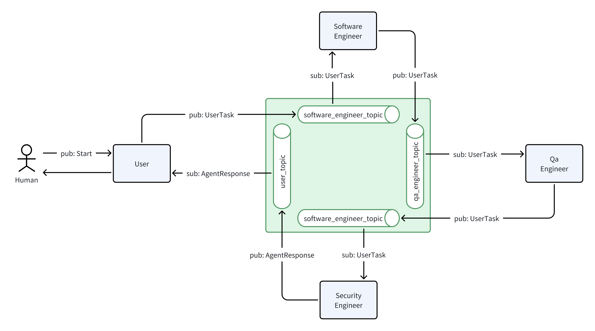

# StarShip App Builder


## Prerequisites

- Install `coagent` (see [Installation](../../README.md#installation)).
- Start a NATS server (see [Distributed](../../README.md#distributed)).


## Quick Start

First, start the dev agent:

```bash
export AZURE_MODEL=csg-gpt4
export AZURE_API_BASE=https://opencsg-us.openai.azure.com
export AZURE_API_VERSION=2024-02-15-preview
export AZURE_API_KEY=<YOUR API KEY>

python examples/app-builder/dev.py
```

And then start the qa agent in the second terminal:

```bash
export AZURE_MODEL=csg-gpt4
export AZURE_API_BASE=https://opencsg-us.openai.azure.com
export AZURE_API_VERSION=2024-02-15-preview
export AZURE_API_KEY=<YOUR API KEY>

python examples/app-builder/qa.py
```

### Static Orchestration (Team)
And then start the team agent in the third terminal:

```bash
python examples/app-builder/team.py
```

Finally, start a client in the fourth terminal.

```bash
python examples/rich_client.py team
User> Generate a calculator in Tkinter.
```

### Dynamic Orchestration (Auto-Team)

And then start the auto-team agent in the third terminal:

```bash
python examples/app-builder/auto_team.py
```

Finally, start a client in the fourth terminal.

```bash
python examples/rich_client.py auto_team
User> Generate a calculator in Tkinter.
```

## Architecture

<p align="center">

</p>
